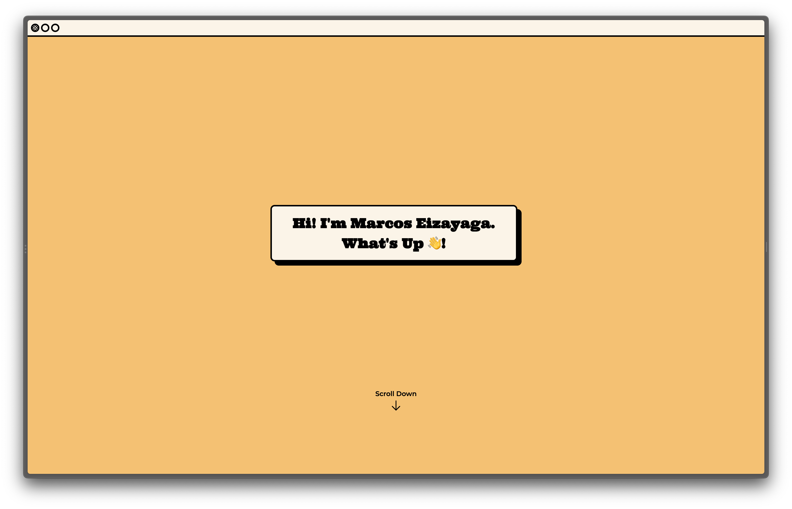

# Personal Website

This is the v2 of my personal site built using [Astro](https://astro.build/). It will function as a blog to track the things I have done and learned.



---

```
npm create astro@latest -- --template portfolio
```

## 🧞 Commands

| Command                | Action                                           |
| :--------------------- | :----------------------------------------------- |
| `npm install`          | Installs dependencies                            |
| `npm run dev`          | Starts local dev server at `localhost:3000`      |
| `npm run build`        | Build your production site to `./dist/`          |
| `npm run preview`      | Preview your build locally, before deploying     |
| `npm run astro ...`    | Run CLI commands like `astro add`, `astro check` |
| `npm run astro --help` | Get help using the Astro CLI                     |

